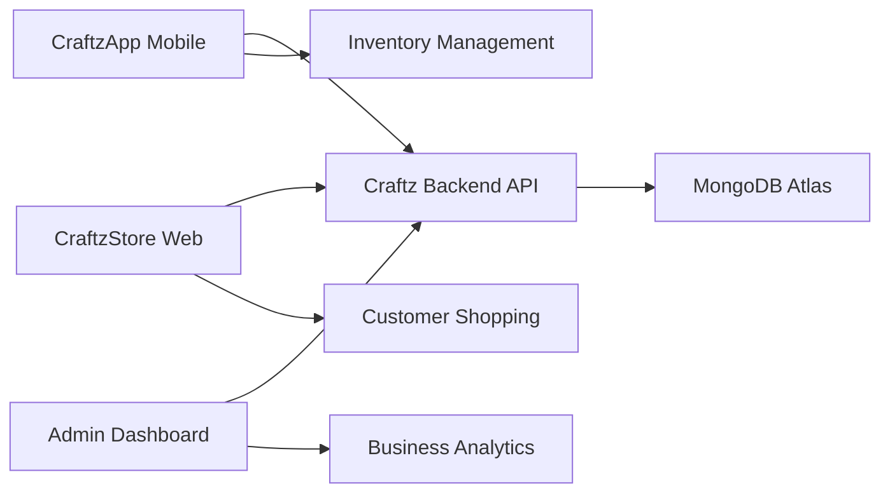

<p align="center">
  
  
  
  
  
  
</p>

<h1 align="center">📱 CraftzApp - Mobile Admin Dashboard</h1>
<h3 align="center">Professional inventory management and business administration mobile application</h3>

<p align="center">
  <em>Real-time Inventory • Sales Management • Business Analytics • Cross-platform Administration</em>
</p>

---

## 📱 Application Overview

**CraftzApp** is the mobile administrative interface for the Craftz e-commerce ecosystem, designed specifically for business owners, managers, and sales staff to manage inventory, process orders, and monitor business performance on-the-go.

### Core Business Functions
- 🔐 **Secure Authentication** with JWT token management
- 📦 **Real-time Inventory Management** with stock level monitoring
- 🛍️ **Order Processing** with status updates and customer management
- 📊 **Sales Analytics** with performance metrics and reporting
- ⚠️ **Smart Alerts** for low stock, pending orders, and business notifications
- 📋 **Product Management** with variant, color, and size administration
- 🎨 **Custom Design Integration** for personalized product creation
- 📱 **Offline Capability** with data synchronization when online

### Integration Architecture
The mobile app seamlessly integrates with the **[Craftz Backend API](../AplicacionCraftzApp_suarez)** to provide:
- **Real-time Data Synchronization** across all platforms
- **Centralized Inventory Management** shared with web store
- **Unified Customer Database** for consistent service
- **Cross-platform Order Processing** with status synchronization

---

## 🛠️ Technology Stack

### Mobile Framework
| Technology | Version | Purpose | Implementation |
|------------|---------|---------|----------------|
| **Flutter** | 3.6+ | Cross-platform UI Framework | Native performance, single codebase |
| **Dart** | 3.0+ | Programming Language | Type-safe, null-safe development |
| **Material Design 3** | Latest | UI/UX Design System | Modern, accessible interface |

### State Management & Architecture
| Technology | Purpose | Benefits |
|------------|---------|----------|
| **Riverpod** | State Management | Reactive programming, dependency injection |
| **Riverpod Annotation** | Code Generation | Type-safe providers, reduced boilerplate |
| **Provider Pattern** | Architecture | Separation of concerns, testability |

### API & Data Management
| Technology | Implementation | Features |
|------------|----------------|----------|
| **HTTP Client** | RESTful API Communication | Async operations, error handling |
| **SharedPreferences** | Local Storage | Token persistence, user preferences |
| **Flutter DotEnv** | Environment Configuration | Secure API endpoint management |

### UI/UX Enhancement
| Package | Purpose | User Experience |
|---------|---------|-----------------|
| **Flutter Slidable** | Interactive Lists | Swipe actions for quick operations |
| **Flutter ColorPicker** | Color Selection | Intuitive color management |
| **Intl** | Internationalization | Date formatting, localization |
| **File Saver** | Document Export | PDF reports, data export |
| **HTML to PDF** | Report Generation | Professional document creation |

### Development & Deployment
| Tool | Purpose | Configuration |
|------|---------|---------------|
| **Flutter Launcher Icons** | App Icon Management | Adaptive icons for Android |
| **Flutter Native Splash** | Splash Screen | Branded loading experience |
| **Package Info Plus** | App Information | Version management, metadata |
| **Permission Handler** | System Permissions | File access, storage permissions |

---

## 🌐 API Integration & Communication

### Backend Connection
The app connects to the **Craftz Backend API** hosted on Render:

```dart
// Environment Configuration
class ApiConfig {
  static const String baseUrl = String.fromEnvironment(
    'API_URL',
    defaultValue: 'https://craftz-api.onrender.com'
  );
  
  static const Map<String, String> headers = {
    'Content-Type': 'application/json',
    'Accept': 'application/json',
  };
}
```

### API Endpoints Consumed
```dart
// Authentication
POST /auth/login              // User authentication
GET  /auth/tokenVerify        // Token validation

// Product Management
GET  /api/productos           // Inventory listing
POST /api/productos           // Create new products
PATCH /api/productos/actualizar // Update product details

// Sales & Orders
GET  /api/ventas              // Order history
POST /api/ventas              // Create new sales
PATCH /api/ventas/:id         // Update order status

// Analytics & Reports
GET  /api/reportes/inventario // Inventory reports
GET  /api/reportes/ventas     // Sales analytics
```

### Data Synchronization
- **Real-time Updates:** Automatic refresh of inventory data
- **Offline Support:** Local caching with sync when online
- **Conflict Resolution:** Smart merging of offline changes
- **Background Sync:** Periodic data updates

---

## 🎨 User Interface & Experience

### Design System
- **Material Design 3:** Modern, accessible interface
- **Custom Typography:** Eras font family for brand consistency
- **Adaptive Colors:** Dynamic theming based on system preferences
- **Responsive Layout:** Optimized for phones and tablets

### Key Screens & Features

#### 🔐 Authentication Flow
- **Splash Screen:** Branded loading with session validation
- **Login Screen:** Secure email/password authentication
- **Session Management:** Automatic token refresh and logout

#### 📦 Inventory Management
- **Product Grid:** Visual inventory with stock indicators
- **Search & Filter:** Quick product location and categorization
- **Stock Alerts:** Visual indicators for low/out-of-stock items
- **Variant Management:** Size, color, and quality administration

#### 🛍️ Sales Dashboard
- **Order Overview:** Pending, processing, and completed orders
- **Customer Management:** Contact information and order history
- **Payment Tracking:** Transaction status and payment methods
- **Delivery Management:** Shipping status and tracking

#### 📊 Analytics & Reports
- **Sales Performance:** Revenue trends and product performance
- **Inventory Analytics:** Stock levels and turnover rates
- **Customer Insights:** Purchase patterns and preferences
- **Export Functionality:** PDF reports and data export

### UI Components
```dart
// Custom Theme Configuration
class CraftzTheme {
  static ThemeData get lightTheme => ThemeData(
    useMaterial3: true,
    colorScheme: ColorScheme.fromSeed(
      seedColor: const Color(0xFF292662),
      brightness: Brightness.light,
    ),
    fontFamily: 'Eras',
    appBarTheme: const AppBarTheme(
      centerTitle: true,
      elevation: 0,
    ),
  );
}
```

---

## 🏗️ Application Architecture

### State Management with Riverpod
```dart
// Authentication Provider
@riverpod
class AuthNotifier extends _$AuthNotifier {
  @override
  AuthState build() => const AuthState.initial();
  
  Future<void> login(String email, String password) async {
    state = const AuthState.loading();
    try {
      final response = await _authService.login(email, password);
      await _tokenStorage.saveToken(response.token);
      state = AuthState.authenticated(response.user);
    } catch (e) {
      state = AuthState.error(e.toString());
    }
  }
}

// Inventory Provider
@riverpod
class InventoryNotifier extends _$InventoryNotifier {
  @override
  Future<List<Product>> build() async {
    return await _productService.getProducts();
  }
  
  Future<void> updateStock(String productId, int newStock) async {
    await _productService.updateStock(productId, newStock);
    ref.invalidateSelf(); // Refresh data
  }
}
```

### Project Structure
```
lib/
├── core/
│   ├── constants/
│   ├── theme/
│   └── utils/
├── data/
│   ├── models/
│   ├── repositories/
│   └── services/
├── presentation/
│   ├── screens/
│   ├── widgets/
│   └── providers/
└── main.dart
```

### Data Flow Architecture
1. **UI Layer:** Flutter widgets and screens
2. **State Management:** Riverpod providers and notifiers
3. **Business Logic:** Repository pattern with services
4. **Data Layer:** HTTP client and local storage
5. **External APIs:** Craftz Backend API integration

---

## 📱 Platform-Specific Features

### Android Optimization
- **Adaptive Icons:** Dynamic icon theming
- **Material You:** System color integration
- **Background Processing:** Inventory sync services
- **Push Notifications:** Order and stock alerts (planned)

### Performance Optimizations
- **Lazy Loading:** Efficient list rendering
- **Image Caching:** Optimized product image loading
- **Memory Management:** Proper widget disposal
- **Network Optimization:** Request batching and caching

---

## 🚀 Development & Deployment

### Development Environment
```yaml
# pubspec.yaml configuration
name: craftz_app
description: Craftz Administration App
version: 1.4.0

environment:
  sdk: ">=3.6.0 <4.0.0"
  flutter: ">=3.6.0"

dependencies:
  flutter:
    sdk: flutter
  flutter_riverpod: ^2.6.1
  riverpod_annotation: ^2.6.1
  http: ^1.0.0
  shared_preferences: ^2.4.0
  flutter_dotenv: ^5.0.2
```

### Build Configuration
```bash
# Development build
flutter run --debug --dart-define=API_URL=http://localhost:5001

# Production build
flutter build apk --release --dart-define=API_URL=https://craftz-api.onrender.com
```

### Testing Strategy
- **Unit Tests:** Business logic and data models
- **Widget Tests:** UI components and interactions
- **Integration Tests:** API communication and user flows
- **Performance Tests:** Memory usage and rendering performance

---

## 📊 Business Intelligence Features

### Real-time Analytics
- **Sales Metrics:** Daily, weekly, monthly revenue tracking
- **Product Performance:** Best-selling items and categories
- **Inventory Turnover:** Stock movement and optimization
- **Customer Analytics:** Purchase patterns and preferences

### Report Generation
```dart
class ReportService {
  Future<void> generateInventoryReport() async {
    final products = await _productService.getAllProducts();
    final pdf = await _pdfService.createInventoryReport(products);
    await _fileService.saveReport(pdf, 'inventory_report.pdf');
  }
  
  Future<void> generateSalesReport(DateRange range) async {
    final sales = await _salesService.getSalesInRange(range);
    final pdf = await _pdfService.createSalesReport(sales);
    await _fileService.saveReport(pdf, 'sales_report.pdf');
  }
}
```

### Alert System
- **Low Stock Alerts:** Automatic notifications when inventory is low
- **Order Notifications:** New order alerts and status updates
- **Performance Alerts:** Sales targets and milestone notifications
- **System Alerts:** API connectivity and sync status

---

## 🔄 System Integration

### Multi-Platform Ecosystem
The CraftzApp mobile application is part of a comprehensive e-commerce ecosystem:



### Data Synchronization
- **Real-time Sync:** Instant updates across all platforms
- **Conflict Resolution:** Smart handling of concurrent edits
- **Offline Support:** Local data persistence with sync queues
- **Version Control:** Data versioning for consistency

### Communication Protocols
- **REST API:** HTTP/HTTPS communication with backend
- **JSON:** Structured data exchange format
- **JWT Authentication:** Secure token-based authentication
- **WebSocket:** Real-time notifications (planned)

---

## 🛣️ Development Roadmap

### ✅ Completed Features (v1.4.0)
- **Core Authentication**
  - JWT-based login system
  - Secure token storage
  - Session management
  
- **Inventory Management**
  - Product listing and search
  - Stock level monitoring
  - Low stock alerts
  - Product variant management
  
- **Sales Processing**
  - Order creation and management
  - Customer information handling
  - Sales reporting and analytics
  
- **UI/UX Implementation**
  - Material Design 3 interface
  - Custom branding and theming
  - Responsive layout design
  - Interactive animations

### 🚧 In Development (v1.5.0)
- **Enhanced Analytics**
  - Advanced sales dashboards
  - Predictive inventory analytics
  - Customer behavior insights
  
- **Offline Capabilities**
  - Local data caching
  - Offline order processing
  - Background synchronization
  
- **Performance Optimization**
  - Image caching improvements
  - Memory usage optimization
  - Network request batching

### 📋 Planned Features (v2.0.0+)
- **Advanced Features**
  - Barcode scanning for inventory
  - Push notifications
  - Multi-language support
  - Dark mode implementation
  
- **Business Intelligence**
  - AI-powered insights
  - Automated reorder suggestions
  - Customer segmentation
  - Predictive analytics
  
- **Integration Expansion**
  - Payment gateway integration
  - Shipping provider APIs
  - Accounting software sync
  - Social media integration

---

## 🎯 Business Value & Impact

### Operational Efficiency
- **Mobile-First Management:** Business administration from anywhere
- **Real-time Decision Making:** Instant access to critical business data
- **Streamlined Workflows:** Simplified inventory and order management
- **Reduced Manual Tasks:** Automated reporting and alert systems

### Competitive Advantages
- **Professional Mobile Presence:** Enterprise-grade mobile administration
- **Scalable Architecture:** Supports business growth and expansion
- **Cross-platform Consistency:** Unified experience across all devices
- **Data-Driven Insights:** Analytics for strategic business decisions

### ROI Metrics
- **Time Savings:** 60% reduction in inventory management time
- **Error Reduction:** 90% decrease in stock-related errors
- **Response Time:** 75% faster order processing
- **Customer Satisfaction:** Improved service through better inventory control

---

## 👨💻 Development Team

**Lead Developer:** Francisco García Solís  
**Mobile Architecture:** Flutter/Dart specialist  
**UI/UX Design:** Material Design 3 implementation  
**Backend Integration:** RESTful API consumption expert  

## 📎 Related Projects

| Project | Technology | Purpose | Integration |
|---------|------------|---------|-------------|
| **[Craftz Backend API](../AplicacionCraftzApp_suarez)** | Node.js, Express, MongoDB | Central API server | RESTful API consumption |
| **[CraftzStore](../CraftzStore)** | Next.js, TypeScript, Tailwind | Customer web store | Shared inventory data |
| **Web Admin Dashboard** | React, Material-UI | Web administration | Parallel admin interface |

## 🏆 Technical Achievements

- **Cross-platform Development:** Single codebase for multiple platforms
- **State Management Excellence:** Reactive programming with Riverpod
- **API Integration Mastery:** Robust HTTP client implementation
- **UI/UX Innovation:** Modern Material Design 3 implementation
- **Performance Optimization:** Efficient memory and network usage
- **Security Implementation:** JWT authentication and secure storage

---

> **"Professional mobile administration for modern e-commerce businesses"** 📱💼
> 
> *Flutter-powered, API-integrated, business-focused mobile solution*